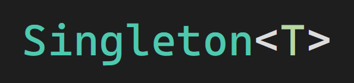
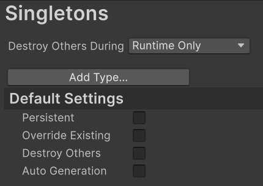
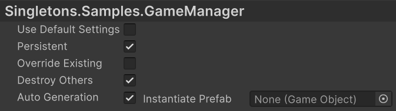
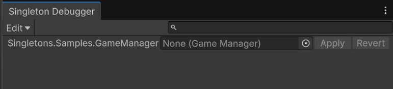

- [About](#about)
- [Installation](#installation)
	- [Manual (Recommended)](#manual-recommended)
	- [Unity Package Manager (UPM)](#unity-package-manager-upm)
	- [Unity Asset Store](#unity-asset-store)
- [Usage](#usage)
	- [Project Settings](#project-settings)
	- [Debugger](#debugger)
- [Technical Details](#technical-details)
	- [Known Limitations](#known-limitations)
	- [Requirements](#requirements)
	- [Revision History](#revision-history)

# About

Use the Singletons package to create objects that act as a single point of governance or "manager" of some feature in your game.
For example, Most projects use a `GameManager` script to manage things like player score, save data, loading scenes, etc. There should only ever be one active instance of this script at a time, and that instance must be accessible globally.
This package also features a tab in the project settings where the behaviour for each singleton type can be configured.

# Installation

## Manual (Recommended)

Manual installation is recommended as it gives you free reign to modify anything within the package for your own use cases, with the added bonus of not being restricted by Unity's license agreement.

1. Download the `.unitypackage` file under the [latest release](https://github.com/JDoddsNAIT/Singletons/releases).
2. Open your Unity project.
3. Open 'Assets -> Import Package -> Custom Package...'
4. Locate and select the downloaded file from step 1.
5. Click "Import"

## Unity Package Manager (UPM)

Follow the instructions below to install using the Unity Package Manager.

1. Open your Unity project.
2. Open the Package manager (Window -> Package Management -> Package Manager)
3. Click the '+' icon, and select "Install package from git URL"
4. Copy and paste in the link below, then click "Install".
```
git+https://github.com/JDoddsNAIT/Singletons.git#v1.1.1
``` 

## Unity Asset Store

Click [here]() to install from the Unity Asset Store. (Coming soon!)

# Usage
To create a singleton class, simply create a class that derives from `Singleton<T>`, as shown below:

```cs
using Singletons;

public class MyClass : Singleton<MyClass>
{
	// Script code goes here
}
```

Each singleton has a static reference to a single instance of its own type, called the Main Instance. Use the `GetInstance()` method to retrieve the current main instance.

Optionally, you may override the `Initialize()` method in your script.
```cs
using Singletons;

public class MyClass : Singleton<MyClass>
{
	protected override void Initialize() {

	}

	// Script code goes here
}
```
The `Initialize()` method is called whenever that instance is set as the Main instance. Typically, this only happens once on `Awake()`, or not at all if a Main instance already exists and "Override Existing" is set to false.

## Project Settings

You can configure the behaviour of singletons by going to `Edit > Project Settings > Singletons`.
Here you can also configure the default settings that apply to all types not shown in the settings, and any types with "Use Default Settings" checked.



The "Destroy Others During" field is used configure if singletons will only be destroyed automaticaly at runtime, in the editor, or both.

All singleton types will appear in the settings after being added to any object in the scene. 
However if the script you're looking for does not appear in the settings, click the "Add Type" button and select the script type from the dropdown menu.



By default, a singleton will simply set itself as the main instance if there is not one already as soon as the script is loaded.
However, you can change this behaviour using the following options:

- **Persistent**: The main instance will persist between scenes.
- **Override Existing**: The most recently initialized object will be set as the main instance.
- **Destroy Others**: Instances that are not the main will be destroyed automatically.
- **Auto-Generation**: When the `GetInstance()` method is called and no main instance exists, a new GameObject will be created with the script attached. This new object becomes the main instance.

If Auto-Generation is enabled, you also have the option to create the singleton from a prefab instead of an empty GameObject. This prefab must have the script attached **at the root of the prefab**, as the children are not searched when getting the singleton component.

## Debugger

As of version 1.1.0, you can find the debugger menu under `Window > Analysis > Singleton Debugger`.
This screen will allow you to view the main instance of all singletons in your project.



Each row in the list displays the singleton type, followed by a field which displays the current main instance of that type.
This field can be use to assign a different instance as main.
Any changes made to this field will not be applied until the user presses the "Apply" button, upon which the new instance will be assigned.
Changes made through the debug menu **does not** bypass the logic configured in the project settings, thus instances may be destroyed when changes are applied.

# Technical Details

## Known Limitations
- **Multi-Inheritance is not currently supported.** If multiple different classes derive from the same singleton base type (such as in the example below), **The settings for those types will be ignored.** Instead they will inherit the same settings as the base type, and cannot be configured separately.
```cs
using Singletons;

public class ClassA : Singleton<ClassA> { }
// ClassB and ClassC will both inherit the settings from ClassA.
public class ClassB : ClassA { }
public class ClassC : ClassA { }
```

## Requirements
- Unity version 6.0 or greater.

This package depends on Unity's UI Toolkit for the project settings page and debugger window.

## Revision History
|Date|Reason|
|---|---|
June 14th, 2026|Created document.
June 15th, 2026|Added known limitations and expanded usage.
June 16th, 2026|Added info about Destroy Others During and Debugger window.